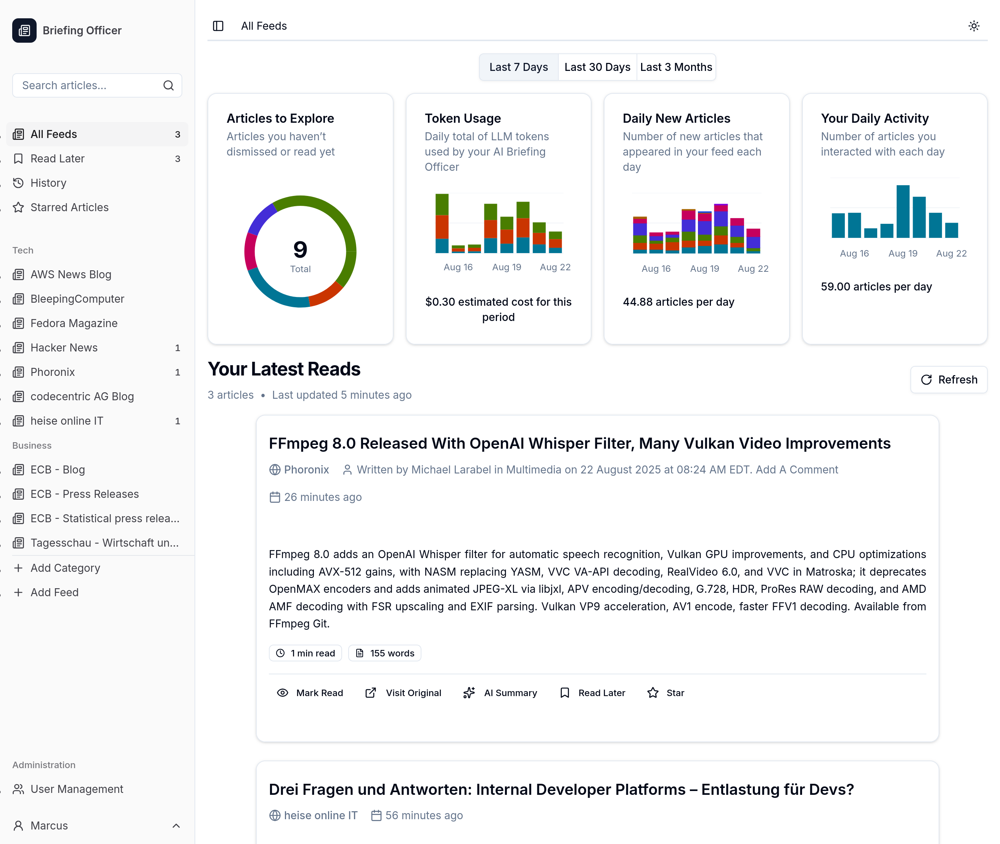

# Briefing Officer

AI summaries for your favorite news feeds.

<!-- prettier-ignore-start -->
> [!WARNING] 
> This software is currently in the prototype stage. Bugs and unexpected 
> breaking changes may occur without prior notice.
<!-- prettier-ignore-end -->



## Getting Started

```
docker run -it --rm \
  -e DATABASE_URL=file:../data/database.sqlite \
  -e AZURE_OPENAI_RESOURCE_NAME=oai-example-dev-001 \
  -e AZURE_OPENAI_API_KEY=lorem-ipsum \
  -p 3000:3000 \
  ghcr.io/marcusleg/briefing-officer:unstable
```

## Development Philosophy

This is a side project built during my free time with a quick-and-dirty
development approach. I'm aware the software engineering practices aren't ideal
in places and I follow much stricter standards in my professional work.

## Architecture Decisions

- Use types generated by Prisma where possible.
  - We choose to accept tight coupling with the database schema to eliminate
    the  
    need for a translation layer between database objects and
    application-specific types, resulting in less code.
- Pass complete Prisma objects to functions rather than individual properties.
  - This improves maintainability and future-proofs the code by avoiding the
    need to update function signatures when new properties are needed. It also
    reduces coupling between functions and specific object properties, making
    the code more flexible and easier to modify.
