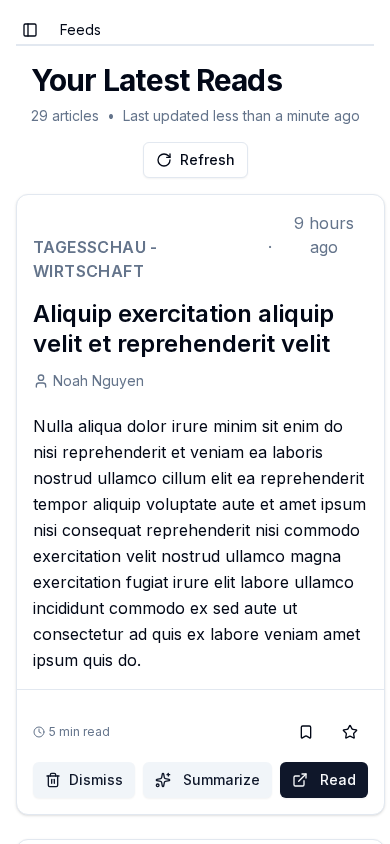
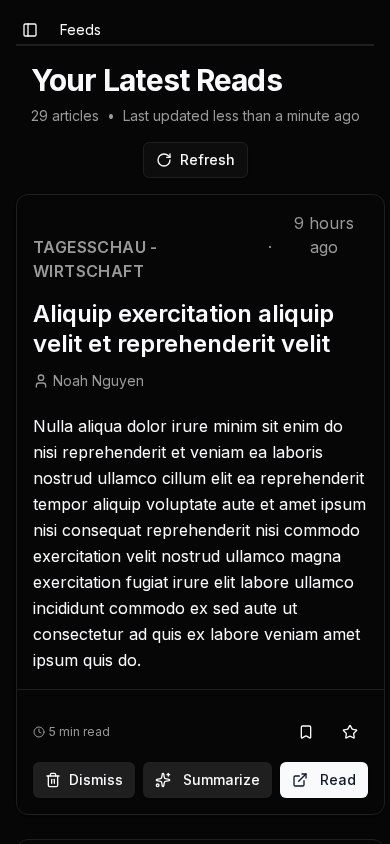
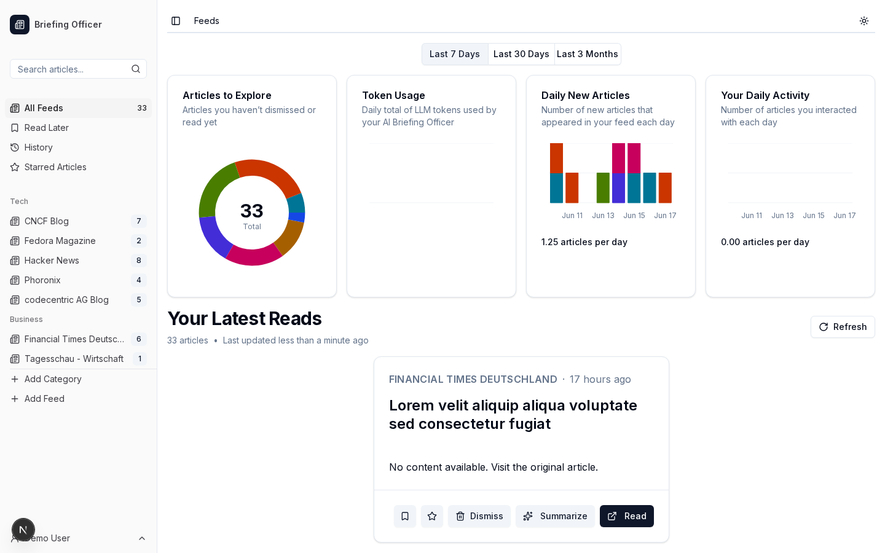
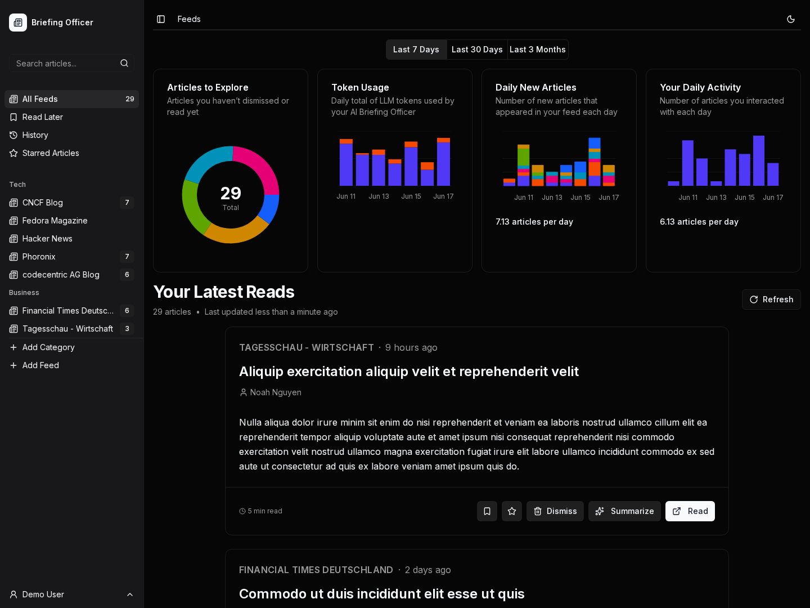

# Briefing Officer

AI summaries for your favorite news feeds.

## Screenshots

<div align="center">
  <a href="./docs/screenshots/mobile-light.png"></a>
  <a href="./docs/screenshots/mobile-dark.png"></a>
  <br/>
  <a href="./docs/screenshots/desktop-light.png"></a>
  <a href="./docs/screenshots/desktop-dark.png"></a>
</div>

## Features

- News reader with RSS and Atom support.
- Two types of AI summaries:
  - **Lead**: A single paragraph summarizing what the article covers and why it
    is significant or timely, capped at 80 words.
  - **Key Facts / Takeaways**: A bullet-point list of 5–12 concise sentences
    highlighting the most important points from the article.
- Save articles for later using the "Read Later" and "Star" feature.
- Support for multiple AI providers (OpenAI, Azure OpenAI, Anthropic, and any
  OpenAI-compatible API).
- Multi-user support.
- Dark mode.
- Mobile friendly design.

## Getting Started

```bash
docker run -it --rm \
  -e DATABASE_URL=file:/data/database.sqlite \
  -e AZURE_OPENAI_RESOURCE_NAME=oai-example-dev-001 \
  -e AZURE_OPENAI_API_KEY=lorem-ipsum \
  -e BETTER_AUTH_SECRET=something-random \
  -e BETTER_AUTH_URL=http://localhost:3000 \
  -e CRON_API_TOKEN=something-else-random \
  -p 3000:3000 \
  ghcr.io/marcusleg/briefing-officer
```

## Configuration

### Application

| Environment Variable | Description                                      |
| -------------------- | ------------------------------------------------ |
| `DATABASE_URL`       | URL to the SQLite database.                      |
| `CRON_API_TOKEN`     | Token required to call the `/api/cron` endpoint. |

### AI Providers

One provider must be configured.

| Environment Variable         | Description                                                                                      |
| ---------------------------- | ------------------------------------------------------------------------------------------------ |
| `AZURE_OPENAI_API_KEY`       | Azure OpenAI API key.                                                                            |
| `AZURE_OPENAI_MODEL`         | Azure OpenAI model name.                                                                         |
| `AZURE_OPENAI_RESOURCE_NAME` | Azure OpenAI resource name.                                                                      |
| `ANTHROPIC_API_KEY`          | Anthropic API key.                                                                               |
| `ANTHROPIC_MODEL`            | Anthropic model name.                                                                            |
| `OPENAI_BASE_URL`            | Optional base URL for OpenAI-compatible API. Defaults to `https://api.openai.com/v1` if not set. |
| `OPENAI_API_KEY`             | API key for OpenAI or OpenAI-compatible provider.                                                |
| `OPENAI_MODEL`               | Model name for OpenAI or OpenAI-compatible provider.                                             |

### Authentication

| Environment Variable                           | Description                                  | Default          |
| ---------------------------------------------- | -------------------------------------------- | ---------------- |
| `AUTH_SECRET`                                  | Secret value used for encryption and hashing |                  |
| `AUTH_SELF_REGISTRATION_ENABLED`               | Allow anyone to create a new account         | `false`          |
| `BASE_URL`                                     | Base URL of Briefing Officer.                |                  |
| `NEXT_PUBLIC_AUTH_GENERIC_OAUTH_ENABLE`        | Enable generic OAuth provider                | `false`          |
| `NEXT_PUBLIC_AUTH_GENERIC_OAUTH_PROVIDER_NAME` | OAuth provider name                          | `Single Sign-On` |
| `AUTH_GENERIC_OAUTH_CLIENT_ID`                 | OAuth client ID                              |                  |
| `AUTH_GENERIC_OAUTH_CLIENT_SECRET`             | OAuth client secret                          |                  |
| `AUTH_GENERIC_OAUTH_DISCOVERY_URL`             | OAuth discovery URL                          |                  |
| `AUTH_GENERIC_OAUTH_PKCE_ENABLED`              | Enable PKCE for OAuth flow                   | `false`          |
