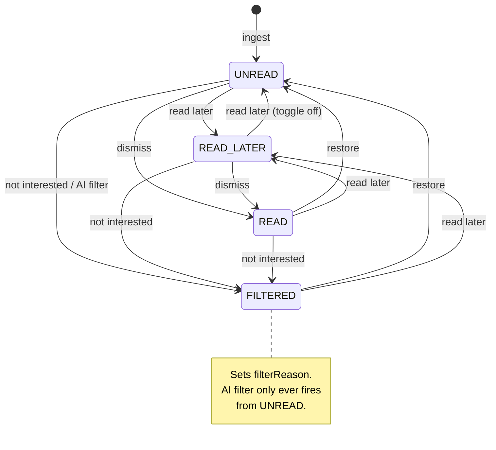

# Article status

What the database holds for an article, and which action moves it where.

## The columns

| Column            | Meaning                                                                        |
| ----------------- | ------------------------------------------------------------------------------ |
| `status`          | `UNREAD` (default) · `READ_LATER` · `READ` · `FILTERED`                        |
| `statusChangedAt` | When `status` last changed. For a `READ` article this _is_ the read timestamp. |
| `filterReason`    | Why it was rejected. Only written alongside `FILTERED`, never cleared.         |
| `starred`         | Independent of `status`. Starring never touches `status` or `statusChangedAt`. |

`UNREAD` and `READ_LATER` are the **inbox** (`isInInbox()` in
`src/lib/article.ts`). `READ` and `FILTERED` are what an article leaves the
inbox for.

## State machine

Every arrow also writes `statusChangedAt = now()`.

## The actions

| Action             | Trigger                                                     | Writes                                                        |
| ------------------ | ----------------------------------------------------------- | ------------------------------------------------------------- |
| **Dismiss**        | `DismissButton` while in inbox, `m` or `v` hotkey           | `status = READ`                                               |
| **Restore**        | Same button while _not_ in inbox, `m` hotkey                | `status = UNREAD`                                             |
| **Read later**     | `ToggleReadLaterButton` (bookmark), from any status         | `status = READ_LATER`; toggling off writes `UNREAD`           |
| **Not interested** | `NotInterestedButton` (thumbs down), hidden when `FILTERED` | `status = FILTERED`, `filterReason = READER_FILTER_REASON`    |
| **AI filter**      | Lead generation at ingest, only if the article is `UNREAD`  | `status = FILTERED`, `filterReason` = model's reason          |
| **Undo**           | Toast / popover after any of the above                      | `status` = whatever it was before, via `restoreArticleStatus` |

Dismiss and Restore are one button: it renders as _Dismiss_ for an inbox article
and as _Restore_ otherwise.

Undo does not apply an inverse — the caller captures the previous status and
hands it back, so undoing a dismiss on a `READ_LATER` article returns it to
`READ_LATER`, not `UNREAD`.

## Bulk and background writes

- **Mark older than N days as read** (per feed or per category) — `UNREAD` →
  `READ` only. Never touches `READ_LATER`.
- **Delete older than N days** — removes any article that is not `READ_LATER`
  and not `starred`, regardless of status.

## Two rules the code depends on

1. `setArticleStatus` in `src/lib/repository/articleRepository.ts` is the
   chokepoint: it always writes `status` and `statusChangedAt` together. Writing
   one without the other breaks History, which reads `statusChangedAt` as the
   read timestamp.
2. There is exactly one deliberate exception: the AI filter verdict in
   `leadService.ts`, which writes both fields itself inside the same update that
   stores the lead. Don't add a second one without revisiting the design.

## Gotchas

- `filterReason` survives a restore. It is only ever written, never reset, and
  the UI simply stops showing it once the status is no longer `FILTERED`.
- The AI filter is guarded on `status === "UNREAD"`. Leads are also backfilled
  lazily from the client for already-rendered articles; without that guard a
  late verdict could pull a `READ_LATER` article out of the queue or clobber a
  read timestamp.
- `markArticleAsNotInteresting` deliberately does **not** revalidate. Its caller
  keeps a popover open over the article it just dismissed and revalidates once
  that popover closes.
