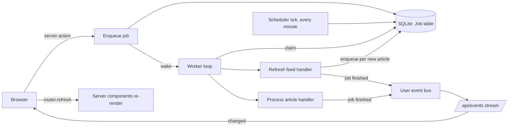

# Background Jobs and Live Updates — Design

Date: 2026-09-13

## Summary

Feed scraping, article scraping, AI lead generation, and AI filtering move out
of the request path and into a background worker that runs inside the
application process. The worker takes its work from a `Job` table in the
existing SQLite database, runs jobs with a bounded concurrency per kind, retries
failures with backoff, and replaces the externally triggered `/api/cron`
endpoint with an in-process scheduler.

Every page a reader has open learns about finished work over a Server-Sent
Events (SSE) stream and re-renders itself. New articles do not push the list
around: they are held back behind a "Show N new articles" button, while leads
and filter verdicts for articles already on screen fill in live.

## Motivation

**User-facing work blocks on network and AI calls.** Pressing Refresh, adding a
feed, or editing a feed awaits every feed fetch, every article scrape, and every
AI call before the button re-enables. Nothing bounds the fan-out: all feeds are
fetched at once and every new article is scraped and summarised at once, which
hammers source sites and the AI provider alike.

**Finished work is invisible until the reader navigates.** The cron job fetches
new articles and generates leads in the background, but a page that is already
open does not change. The reader only sees the new state after a manual reload
or a navigation.

**Failure handling is implicit.** A lead that fails to generate leaves the
article without one, and the article card silently retries it on every render
from the client, with no attempt count, no backoff, and no record of the error.

**Operators run an external cron.** A Kubernetes CronJob, a token, and a network
policy exist only to poke the application every 15 minutes.

The alternative of switching to PostgreSQL to use it as a queue was considered
and rejected. `SKIP LOCKED` and libraries like pg-boss pay off when several
worker processes compete for one queue. This application runs as one replica
with one process and one database file, so a job table in SQLite and a single
in-process worker cover the same ground with far less change.

## Goals

- Server actions and page loads never wait for feed fetches, scrapes, or AI
  calls. Refresh returns as soon as the work is queued.
- Work survives a restart. A crash mid-job is retried, not lost.
- Bounded concurrency per kind of work, and retries with backoff that stop after
  a fixed number of attempts and leave the error visible.
- Open pages update themselves when the worker finishes something for that user,
  including sidebar unread counts.
- New articles arriving while a list is on screen are announced, not inserted.
- The external cron trigger is no longer needed. The application refreshes its
  own feeds on a configurable interval.

## Non-goals

- Multiple application replicas or worker processes. The design relies on there
  being exactly one process.
- An admin UI for jobs. Failed jobs are visible in the database and in the logs.
- Progress reporting for a refresh, such as "3 of 12 feeds done".
- Live updates on pages outside the feed area, such as the admin pages.

## Architecture



Three new server-side units, one route, and two client-side pieces:

| Unit                                      | Responsibility                                                                    |
| ----------------------------------------- | --------------------------------------------------------------------------------- |
| `src/lib/jobs/jobRepository.ts`           | All reads and writes of the `Job` table: enqueue, claim, complete, fail, cleanup. |
| `src/lib/jobs/handlers/*.ts`              | One function per job kind. Pure work; no knowledge of the queue.                  |
| `src/lib/jobs/worker.ts`                  | The loop: claims due jobs, runs handlers within concurrency caps, applies retry.  |
| `src/lib/jobs/scheduler.ts`               | Periodic housekeeping: enqueue due refreshes, sweep missing leads, purge, clean.  |
| `src/lib/events/userEvents.ts`            | In-memory per-user event bus.                                                     |
| `src/instrumentation.ts`                  | Starts the worker and scheduler once per server start.                            |
| `src/app/api/events/route.ts`             | SSE endpoint. Authenticates, subscribes to the bus, streams to the browser.       |
| `src/components/live-updates.tsx`         | Client provider. Opens the SSE stream, refreshes the router, tracks user refresh. |
| `src/components/article/article-list.tsx` | Holds back unseen articles behind a "Show N new articles" button.                 |

### The job table

```prisma
enum JobKind {
  REFRESH_FEED
  PROCESS_ARTICLE
}

enum JobStatus {
  PENDING
  RUNNING
  FAILED
}

model Job {
  id        Int       @id @default(autoincrement())
  kind      JobKind
  targetId  Int
  status    JobStatus @default(PENDING)
  attempts  Int       @default(0)
  runAfter  DateTime  @default(now())
  lastError String?
  createdAt DateTime  @default(now())
  updatedAt DateTime  @updatedAt

  @@unique([kind, targetId])
  @@index([status, runAfter])
}
```

- `targetId` is a feed id for `REFRESH_FEED` and an article id for
  `PROCESS_ARTICLE`. There is no foreign key because the column is polymorphic.
  A job whose target no longer exists is completed without doing anything.
- There is no `DONE` status. A finished job is deleted, which keeps the table
  small and makes the unique index a natural deduplication key.
- The unique index on `(kind, targetId)` means at most one job per piece of work
  exists at any time, whatever its status.

### Enqueueing

Two entry points, differing in what they do when a row already exists:

- **`enqueue(kind, targetId)`** is used by user actions and by handlers. If no
  row exists it creates one. If a `PENDING` or `FAILED` row exists it resets it
  to `PENDING` with `attempts = 0`, `runAfter = now`, and `lastError = null`. A
  `RUNNING` row is left alone. This is what makes a click on Refresh run a feed
  now even if a previous attempt is waiting out its backoff or has given up.
- **`enqueueIfAbsent(kind, targetId)`** is used by the scheduler. It creates a
  row only when none exists, so periodic sweeps never reset the attempt count of
  a job that is retrying or has failed.

Both are implemented as an `updateMany` guarded by status followed by a `create`
that treats a unique-constraint violation as "someone got there first". With one
process the only concurrent writers are parallel server actions, and the unique
index settles those.

After enqueueing, callers call `wakeWorker()` so the job starts within
milliseconds instead of at the next poll.

### Handlers

**`REFRESH_FEED`** does what the current `refreshFeed` does up to and including
the upsert of articles, then enqueues one `PROCESS_ARTICLE` job per article that
did not exist before, and sets the feed's `lastFetched`. It does not wait for
the articles to be processed. If the feed no longer exists, it returns.

**`PROCESS_ARTICLE`** scrapes the article if no `ArticleScrape` row exists yet,
then generates the lead and filter verdict through the existing
`generateAiLead`. A failed scrape is logged and does not fail the job; the lead
is then generated from the title, exactly as today. A failed lead generation
fails the job. If the article no longer exists, it returns.

Handlers are plain async functions
`(targetId: number) => Promise<string | null>` that resolve to the owning user's
id, or `null` when the target is gone. They do not touch the `Job` table except
through `enqueue`, and they do not call `revalidatePath`: the pages are dynamic
server components, so there is no cache to invalidate, and the browser is told
to re-render over SSE instead.

### The worker loop

- **Claiming.** For each kind, the worker knows how many jobs are in flight and
  how many it may run at once. When it ticks, it reads due `PENDING` jobs
  (`runAfter <= now`, ordered by `runAfter` then `id`) up to the free slots for
  that kind and claims each with an `updateMany` guarded by `status: PENDING`. A
  count of 1 means the claim succeeded.
- **Concurrency.** Three `REFRESH_FEED` jobs and four `PROCESS_ARTICLE` jobs may
  run at once. These are constants in `src/lib/jobs/config.ts`, not settings.
- **Completion.** On success the job row is deleted and the owning user is
  notified on the event bus. On failure `attempts` is incremented. If it is
  below five, the job goes back to `PENDING` with `runAfter` set to now plus one
  minute doubled per previous attempt (1, 2, 4, 8, 16 minutes). On the fifth
  failure it becomes `FAILED` with the error message in `lastError`. The user is
  notified either way, so a card whose lead failed permanently stops showing a
  spinner and the page reflects the state the database has.
- **Ticking.** The loop uses a timer chain with a five second poll interval.
  `wakeWorker()` cancels the pending timer and ticks at once. A tick that is
  already running is not re-entered; a wake during a tick schedules one more
  tick immediately after it.
- **Startup.** Before the first tick every `RUNNING` job is reset to `PENDING`,
  since a running job can only be left over from a process that died.

### The scheduler

A separate timer that fires every minute and runs, in order:

1. **Due feed refreshes.** For every feed with `autoRefresh = true` and
   `lastFetched` older than the refresh interval,
   `enqueueIfAbsent(REFRESH_FEED)`. Keying off each feed's own timestamp needs
   no persisted "last run" and self-heals after downtime: whatever is overdue is
   refreshed on the first tick after start.
2. **Missing leads.** For every `UNREAD` article created in the last 24 hours
   that has no `ArticleLead`, `enqueueIfAbsent(PROCESS_ARTICLE)`. This replaces
   the article card's client-side backfill. After 24 hours an article without a
   lead is left alone.
3. **Hourly cleanup**, tracked in memory and run on the first tick after start:
   purge articles past `ARTICLE_RETENTION_DAYS` through the existing
   `deleteArticlesOlderThanXDays`, and delete `FAILED` jobs older than one hour.
   Deleting a failed job lets the next sweep create a fresh one, so a feed that
   is down is retried about hourly rather than abandoned, while a job that keeps
   failing never retries more often than that.

The refresh interval comes from `FEED_REFRESH_INTERVAL_MINUTES`, default 15.

### Lifecycle and process boundaries

`src/instrumentation.ts` exports `register()`. It starts the worker and the
scheduler only when `process.env.NEXT_RUNTIME === "nodejs"`, when
`process.env.NEXT_PHASE` is not the production build phase, and when
`BACKGROUND_WORKER_DISABLED` is not `"true"`. The last guard exists for the
screenshot and end-to-end runs, which seed real feed URLs and must not start
fetching them. The worker modules are imported dynamically inside `register()`,
as the Next.js docs recommend for Node-only code. A failure to start, for
instance because no AI provider is configured, is logged and does not stop the
server from serving pages.

Next.js compiles `instrumentation.ts`, route handlers, and server actions into
separate module graphs, so a plain module-level singleton is not guaranteed to
be the same object in all three. The worker handle and the event bus are
therefore stored on `globalThis` under a namespaced key, the same way Prisma
clients are conventionally kept alive across dev reloads. The Prisma client is
not shared this way; a second client instance in the worker's graph is harmless
for SQLite in WAL mode with the busy timeout already set.

### Live updates

**Event bus.** `userEvents.ts` wraps a Node `EventEmitter` keyed by user id and
exposes `notifyUser(userId)` and `subscribe(userId, listener)`, which returns an
unsubscribe function. There is no payload beyond "something changed"; the
browser refreshes the whole page either way.

**SSE route.** `GET /api/events` resolves the session from the request headers
and answers 401 without one. It returns a `ReadableStream` with
`Content-Type: text/event-stream` and `Cache-Control: no-cache`. On each event
for the user it writes `data: changed\n\n`. Every 20 seconds it writes a comment
line as a heartbeat so proxies and gateways do not close an idle connection.
When the request's abort signal fires it unsubscribes and clears the heartbeat.
The route is force-dynamic.

**Client provider.** `LiveUpdates` is a client component rendered in
`src/app/feed/layout.tsx` around the page content. On mount it opens an
`EventSource` to `/api/events`. On each message it calls `router.refresh()`,
throttled so that a burst of finished jobs causes at most one refresh every two
seconds, with a trailing call so the last event is never dropped. The browser
reconnects on its own if the stream drops. It also provides a context with
`lastUserRefreshAt` and `noteUserRefresh()`, described next.

**Sidebar counts** update as a side effect: `router.refresh()` re-renders the
whole server component tree, including `FeedNavigation`.

### The "new articles" indicator

`ArticleList` keeps one piece of state: the set of article ids it has already
shown, initialised from its first props. On every render it derives:

- `visible`: the articles from props whose id is in the set, in the server's
  order. Existing cards update in place, and articles the server no longer
  returns disappear.
- `heldCount`: the number of articles from props whose id is not in the set.

When `heldCount` is positive, a button above the list reads "Show N new
articles". Clicking it adds every current id to the set, which merges the held
articles in. Keyboard selection stays index-based over `visible`.

One exception adds ids to the set without a click: if `lastUserRefreshAt` from
the `LiveUpdates` context is within the last five minutes, new ids are merged as
they arrive, because the reader asked for this refresh. Refresh buttons call
`noteUserRefresh()` after enqueueing.

The pages render an empty-state component instead of the list when there are no
articles, so a list always mounts with something to show and never holds back
its first batch.

The feed page passes `key={show}` so switching between Unread, All, and Filtered
remounts the list instead of presenting the other view's articles as "new".

**Known limitation.** A live refresh that lands while the reader has the "not
interested" popover open over an article that has just left the list will
unmount that popover. The window is the time between the popover opening and its
own revalidation, and the refresh only fires when a job for the same user
finishes. This is accepted for now.

### Refresh buttons and server actions

`refreshFeed`, `refreshFeeds`, and `refreshCategoryFeeds` in `feedRepository.ts`
keep their names and callers but now enqueue and return. `refreshFeeds` and
`refreshCategoryFeeds` enqueue one `REFRESH_FEED` per auto-refresh feed;
`refreshFeed` enqueues one regardless of `autoRefresh`, since the reader asked.
`createFeed` and `updateFeed` call `refreshFeed` as before, so a new or edited
feed is fetched shortly after saving.

The three refresh buttons show a spinner only while the action runs, which is
now milliseconds, then a toast "Refresh started. New articles will appear as
they arrive." and call `noteUserRefresh()`.

### Removals and hardening

- `src/app/api/cron/route.ts`, `CRON_API_TOKEN`, the Helm `CronJob`, its
  `NetworkPolicy`, and the token's mentions in the README, `.env.example`, and
  the `Containerfile` are removed. The README documents
  `FEED_REFRESH_INTERVAL_MINUTES` and `BACKGROUND_WORKER_DISABLED` instead.
- The article card no longer calls `generateAiLead`. It shows the lead from
  props and a spinner while there is none, and the live refresh replaces the
  spinner when the lead lands.
- `src/lib/scraper.ts` and `src/lib/ai/services/leadService.ts` lose their
  `"use server"` directive. Nothing on the client imports them any more, and the
  directive was exposing `scrapeArticle` and `generateAiLead` as callable
  endpoints without an ownership check.

### Documentation

`docs/prd.md` is updated: the "one cron call" goal becomes "no external
trigger", the operator setup flow drops the cron step, feature 1 mentions live
updates and the new-articles indicator, the constraints section describes the
background worker and hourly purge, and the known gaps note the missing job
admin view.

## Error handling

| Situation                                   | Behaviour                                                                     |
| ------------------------------------------- | ----------------------------------------------------------------------------- |
| Feed fetch fails                            | Job retried with backoff, then `FAILED`. Feed's `lastFetched` unchanged.      |
| Article scrape fails                        | Logged. Lead generated from the title. Job succeeds.                          |
| AI call fails                               | Job retried with backoff, then `FAILED` with the error text.                  |
| Target deleted while job pending or running | Handler returns; job completes and is deleted.                                |
| Process dies mid-job                        | Job is `RUNNING` at startup, reset to `PENDING`, runs again.                  |
| No AI provider configured                   | Worker start fails, error logged, pages still serve. Jobs accumulate.         |
| SSE connection drops                        | Browser reconnects. Any change during the gap is picked up on the next event. |
| Unauthenticated `/api/events` request       | 401, no stream.                                                               |

## Testing

Unit and integration tests run under Vitest against a per-worker SQLite file, as
today. The worker itself is never started in tests; `instrumentation.ts` is not
loaded by Vitest.

- **`jobRepository`** (integration): `enqueue` creates, resets `PENDING` and
  `FAILED`, leaves `RUNNING`; `enqueueIfAbsent` creates only when absent;
  claiming returns only due `PENDING` jobs up to the limit; completing deletes;
  failing applies the backoff schedule and flips to `FAILED` on the fifth
  attempt; startup reset; stale `FAILED` cleanup.
- **Worker** (integration, with stub handlers): respects per-kind concurrency;
  notifies the returned user id; retries a throwing handler; a wake during a
  tick causes one more tick.
- **Handlers** (integration, scraper and AI mocked at the boundary as the
  existing tests do): the existing `refreshFeed` behaviour tests move to the
  refresh handler and gain "enqueues one `PROCESS_ARTICLE` per new article"; the
  process handler skips scraping when a scrape exists, proceeds on scrape
  failure, and returns without work for a missing article.
- **Scheduler** (integration): selects only auto-refresh feeds past the
  interval; sweeps only unread, lead-less articles from the last day; cleanup
  purges and deletes stale failures.
- **`feedRepository`** (integration): the refresh actions enqueue rather than
  process; `createFeed` and `updateFeed` enqueue a refresh.
- **`userEvents`** (unit): subscribe, notify, unsubscribe.
- **`ArticleList`** (component): holds back new ids with the right count, merges
  on click, updates existing articles in place, drops removed ones, auto-merges
  when a user refresh is recent.
- **`LiveUpdates`** (component): with a stubbed `EventSource`, a message calls
  `router.refresh()`, and several messages inside the throttle window call it
  once plus a trailing call.
- **Refresh buttons** (component): call the action, show the toast, note the
  user refresh.

`tests/helpers/db.ts` gains `prisma.job.deleteMany()`.

## Migration and rollout

- One Prisma migration adds the `Job` table and its enums.
- Operators upgrading remove any external cron they configured themselves. The
  Helm chart removes its own. The change ships as a `feat:` commit whose body
  says the cron endpoint is gone and names the new interval variable.
- No data migration. Articles without leads from before the upgrade are picked
  up by the missing-lead sweep if they are less than a day old.
